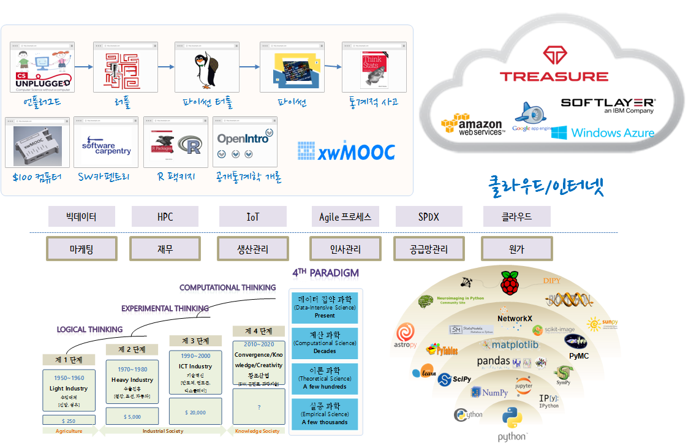
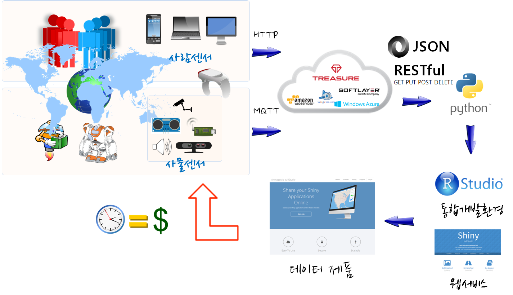

### {.getready}
- 일시: 2015년 12월 22-24일
- 장소: 영남대학교 본교(경산) 상경관 신관 156호 전산실, <a href="http://maps.google.com/maps?q=35.832846, 128.755975">구글지도</a>
- 준비물: 노트북

### IoT  워크샵 위키, 채팅, 공유 서비스
[여기를 클릭해 주세요!](https://public.etherpad-mozilla.org/p/iot-yn)

### 목차

1. 경영학도를 위한 스타트업 기본 (1일차)
    1. [스타트업 사례: xwMOOC $100 오픈 컴퓨터](http://computer.xwmooc.org/)
        - [소프트웨어 제품과 서비스](software-product-service.html): 준비중
        - [소프트웨어 제조](software-manufacuring.html): 준비중
        - [컴퓨터 원가관리](computer-cost-structure.html): 준비중
    1. [지적재산권(IP)](http://statkclee.github.io/open-source-for-business/): 특허, 상표, 저작권, 라이선스
    1. [컴퓨터적 사고(Computational Thinking)](http://statkclee.github.io/dreamtalk/)
         - 컴퓨터과학 언플러그드 [^1]
         - 러플 [^2] / 리보그 [^3]
         - 파이썬 터틀 [^4] [^5]
1. 기본 컴퓨팅 기술 (2일차)
    1. [작업자동화: 유닉스쉘](http://swcarpentry.xwmooc.org/lessons-5-2/novice/shell/index.html)
    1. [이력관리와 협업: Git/GitHub](http://swcarpentry.xwmooc.org/lessons-5-2/novice/git/index.html)
    1. [추상화와 모듈화: R/파이썬](http://swcarpentry.xwmooc.org/lessons-5-2/novice/r/index.html)
    1. [데이터베이스 SQL: Sqlite](http://swcarpentry.xwmooc.org/lessons-5-2/novice/sql/index.html)
    1. 데이터 과학
        - [통계적 사고](http://think-stat.xwmooc.org/)
        - [R 팩키지](http://r-pkgs.xwmooc.org/)
        - [공개통계학 개론](https://github.com/statkclee/openintro-statistics)
1. 스타트업을 위한 IoT (3일차)
    1. [라즈베리 파이 IoT](http://raspberry-pi.xwmooc.org/)
        1. [개발환경 WebIDE](http://statkclee.github.io/raspberry-pi/iot-webide.html)
        1. [센서(ADC)](http://statkclee.github.io/raspberry-pi/sensor.html)        
        1. [웹 데이터(REST)](http://statkclee.github.io/web-data-python/)
        1. [R: RStudio와 Shiny](http://statkclee.github.io/raspberry-pi/iot-rstudio-shiny.html)
            - [ARM 프로세서 가상화](http://statkclee.github.io/raspberry-pi/raspberry-pi-virtual.html)
            - [가상상자(VirtualBox)와 부랑자(Vagrant)](http://statkclee.github.io/raspberry-pi/raspberry-pi-virtual-window.html)
    1. 사례 분석            
        1. [사례: 초음파 센서와 파이켐](http://statkclee.github.io/raspberry-pi/iot-pi-cam.html)
        1. [사례: 오픈소스기반 웹서비스 개발](http://statkclee.github.io/raspberry-pi/reeborg.html)
    1. 다큐먼트 퍼블리싱
        - [LaTeX](http://statkclee.github.io/raspberry-pi/latex.html)
        - [파이썬 스핑크스: 마크다운](http://statkclee.github.io/raspberry-pi/latex-sphinx.html)
        - [R 마크다운: Pandoc](http://statkclee.github.io/pyr-cloudlayer/04-docker-r-pkgs.html)
    1. [xwMOOC $100 오픈컴퓨터](http://computer.xwmooc.org/)
        - [$100 오픈 컴퓨터 워크샵](http://statkclee.github.io/ocworkshop/)
    1. [IBM IoT 클라우드](http://statkclee.github.io/pyr-cloudlayer/)
1. [아두이노 (맥)](mac-helloworld.html)

### 참고자료

- 한국통계진흥원에서 발간 [통계의 창 (2015년 여름호)](http://sti.kostat.go.kr/)
    - 통계교육원 > 열린교육방 > e-book 게시판
    - [미래인재 데이터과학지: 교육사례중심](./xwMOOC.pdf)
    - [전체 다운로드(100MB)](http://sti.kostat.go.kr/coresti/site/board/fileDownLoad.do?file_name=1&nots_seq=2046)

- [강서양천신문](http://www.gynews.net/) '15년 9월
    - [기고, 컴퓨터 사고력과 소프트웨어 교육](http://www.gynews.net/bbs/bbs.asp?exe=view&group_name=104&section=7&category=0&idx_num=19311&page=1&search_category=&search_word=&order_c=bd_idx_num&order_da=desc)
    - [기고, 글을 쓰는 것은 소프트웨어 개발이다!](http://www.gynews.net/bbs/bbs.asp?exe=view&group_name=104&section=7&category=0&idx_num=19140&page=1&search_category=&search_word=&order_c=bd_idx_num&order_da=desc)
 

[^1]: [컴퓨터과학 언플러그드](http://unplugged.xwmooc.org)
[^2]: [러플(Rur-ple)](http://rur-ple.xwmooc.org/)
[^3]: [리보그(Reeborg)](http://reeborg.xwmooc.org/), [Reeborg in Canada](http://reeborg.ca/docs/kr/)
[^4]: [소프트웨어 카펜트리 거북이 (영문)](http://swcarpentry.github.io/python-novice-turtles/)
[^5]: [소프트웨어 카펜트리 거북이 (국문)](http://swcarpentry.github.io/python-novice-turtles/index-kr.html)
