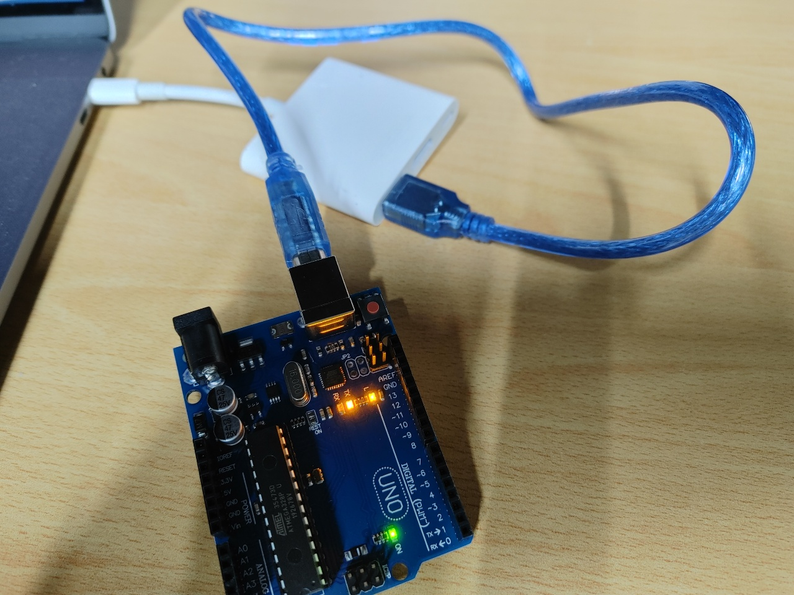
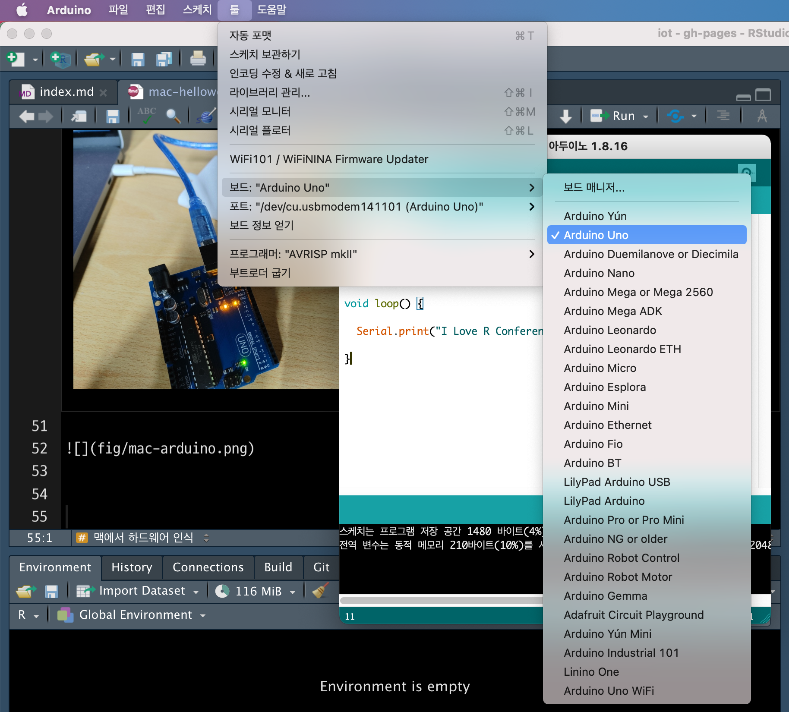
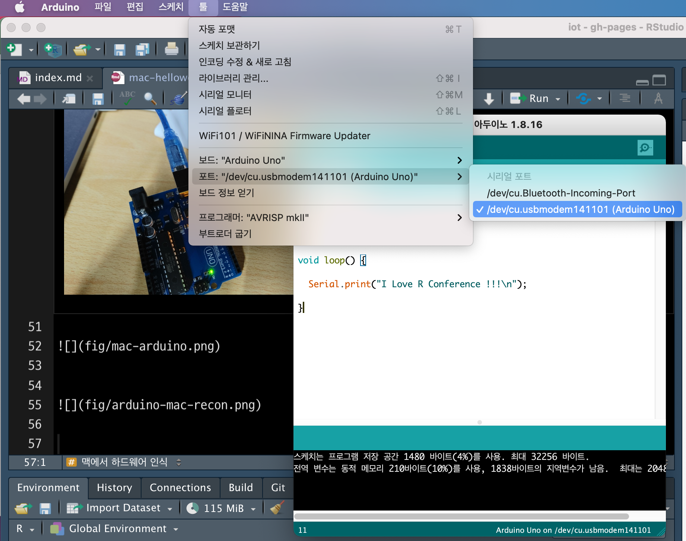
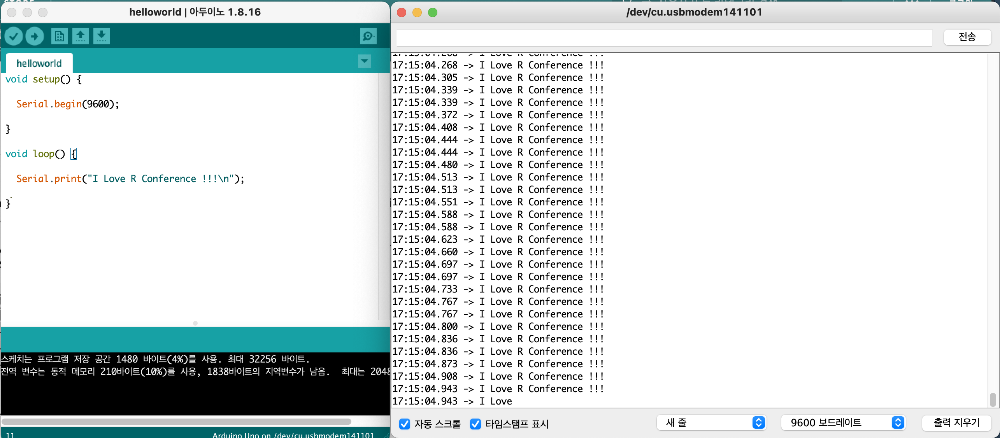

```{r setup, include=FALSE}
knitr::opts_chunk$set(echo = TRUE, message=FALSE, warning=FALSE,
                      comment="", digits = 3, tidy = FALSE, prompt = FALSE, fig.align = 'center')

```

# 아두이노 연결 [^1] {#arduino-connect}

[^1]: [아두이노 설치(Mac OS) / 개발환경 구축](https://m.blog.naver.com/PostView.naver?isHttpsRedirect=true&blogId=go4693&logNo=221524941026)

가장 먼저 맥북에 아두이노를 케이블을 이용하여 연결한다.



# 아두이노 개발환경 다운로드 {#arduino-ide}

아두이노 개발을 위한 개발환경을 다운로드 한다. 이는 마치 R 개발을 위해 RStudio IDE를 다운로드 받아 맥에 설치하는 것과 유사하다.

-   [아두이노 다운로드](https://www.arduino.cc/en/software)

# 맥에서 하드웨어 인식 {#arduino-hw-recon}

아두이노 개발환경을 설치하게 되면 다음 단계로 아두이노를 맥에서 인식하도록 설정을 해준다. 이유는 다양한 아두이노 버전의 하드웨어가 존재하기 때문에 하드웨어를 인식시키고 커뮤니케이션 채널도 연결시킨다.

-   툴 → 보드 → "Arduino Uno"



-   툴 → 포트 → "Arduino Uno"



# 헬로 월드 {#helloworld}

컴파일한 후에 아두이노로 코드를 넘기게 되면 실행결과를 확인할 수 있다. 아두이노 IDE 우축 상단 **시리얼모니터**를 클릭하게 되면 정상 동작됨을 확인할 수 있다.

```{r helloworld-arduio, eval = FALSE}
void setup() {

  Serial.begin(9600);

}

void loop() {
  
  Serial.print("I Love R Conference !!!\n");

}
```



