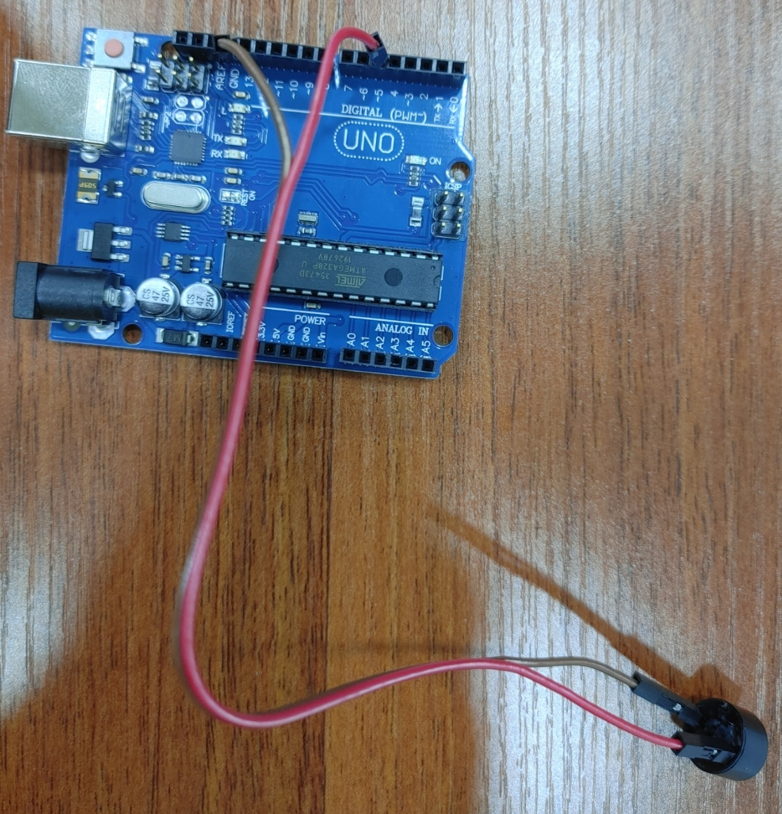
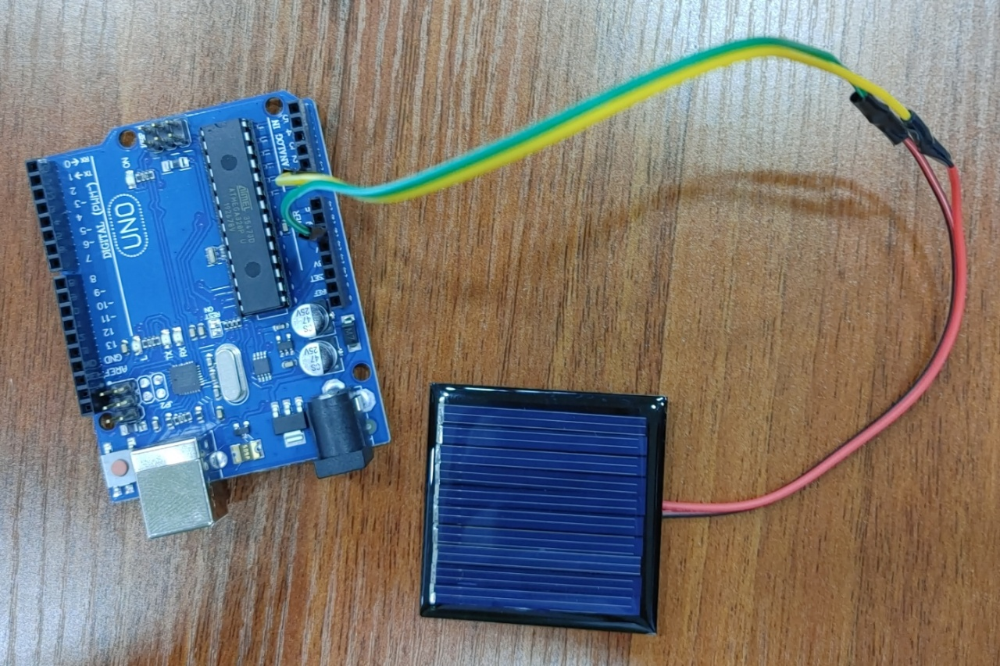
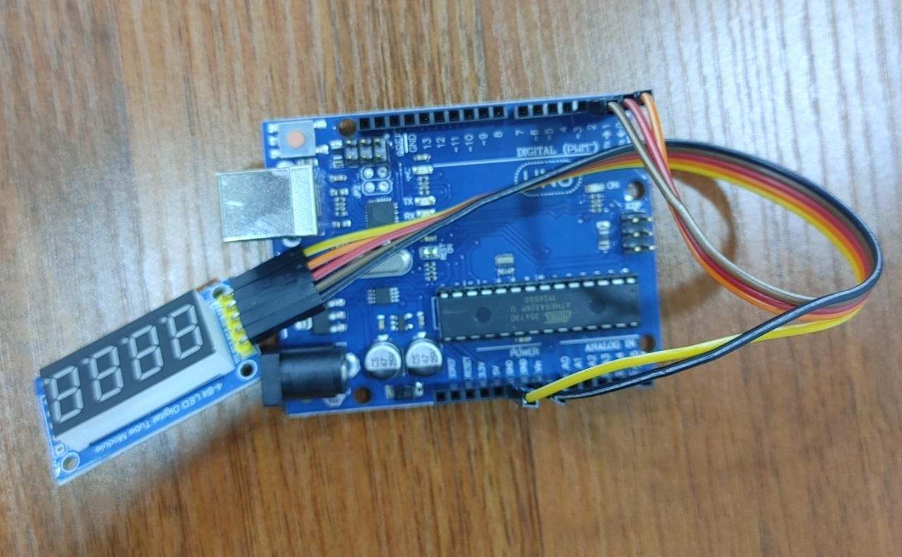

```{r setup, include=FALSE}
knitr::opts_chunk$set(echo = TRUE, message=FALSE, warning=FALSE,
                      comment="", digits = 3, tidy = FALSE, prompt = FALSE, fig.align = 'center')

```

# 부져 울리는 기능 {#buzzer}

먼저 부저를 아두이노와 연결시킨다.



- 그라운드 (검은색)
- 5번 포트 (빨간색)

```{r buzzer, eval = FALSE}
# buzzer
const int buzzer = 5; // 부저를 5번 포트

void setup(){
 
  pinMode(buzzer, OUTPUT); // 출력을 5번 포트로 내보냄

}

void loop(){
 
  tone(buzzer, 440, 100);
  delay(2000); // 2초 쉼
  noTone(buzzer);
  
}
```

# 부져 제어 기능 {#buzzer-controller}

# 태양광 발전 {#generate-solar-energy}



- 아두이노 ANALOG IN : A0 포트
- 아두이노 POWER : GND 포트

```{r solar-generate, eval = FALSE}
#include <SoftwareSerial.h>

int solar_input = A0; // 태양광 패널 인풋

void setup() {
    Serial.begin(9600);
    pinMode(solar_input, INPUT); // 태양광 전류 인풋
}

void loop() {
  
  int solar_value;
  solar_value = analogRead(solar_input);
  
  delay(1000);
  Serial.print(" salor panel = ");
  Serial.print(solar_value);
  Serial.print("\n");
  
}
```

태양광 패널을 밝은 태양이 있는 곳과 어두운 곳을 옮겨갈 때 태양광 패널에서 생산하는 전략을 씨리얼 모니터를 통해 확인이 가능하다.

```{r solar-value, eval = FALSE}
20:56:53.234 ->  salor panel = 479
20:56:54.263 ->  salor panel = 379
20:56:55.255 ->  salor panel = 474
20:56:56.265 ->  salor panel = 530
20:56:57.255 ->  salor panel = 532
20:56:58.246 ->  salor panel = 533
20:56:59.247 ->  salor panel = 532
20:57:00.268 ->  salor panel = 529
20:57:01.247 ->  salor panel = 531
20:57:02.276 ->  salor panel = 533
20:57:03.271 ->  salor panel = 746
20:57:04.268 ->  salor panel = 827
20:57:05.263 ->  salor panel = 775
20:57:06.285 ->  salor panel = 827
20:57:07.284 ->  salor panel = 745
20:57:08.277 ->  salor panel = 976
20:57:09.269 ->  salor panel = 990
20:57:10.267 ->  salor panel = 975
20:57:11.284 ->  salor panel = 974
20:57:12.283 ->  salor panel = 964
20:57:13.289 ->  salor panel = 913
20:57:14.295 ->  salor panel = 900
20:57:15.288 ->  salor panel = 960
20:57:16.303 ->  salor panel = 908
20:57:17.299 ->  salor panel = 573
20:57:18.292 ->  salor panel = 510
20:57:19.280 ->  salor panel = 252
20:57:20.278 ->  salor panel = 223
20:57:21.312 ->  salor panel = 548
20:57:22.283 ->  salor panel = 536
20:57:23.293 ->  salor panel = 514
20:57:24.288 ->  salor panel = 1
20:57:25.299 ->  salor panel = 4
20:57:26.303 ->  salor panel = 6
20:57:27.300 ->  salor panel = 9
```


# 디지털 디스플레이 [^show-display] {#digital-display}

[^show-display]: [Arduino Forum, "4 Bits Digital Tube LED Display Module library"](https://forum.arduino.cc/t/4-bits-digital-tube-led-display-module-library/375305)



핀의 위치는 다음과 같다.

- SCLK = 2
- RCLK = 1
- DIO = 0
- GND = GND
- VCC = VCC


```{r arduino-code, eval = FALSE}
unsigned char LED_0F[] = 
{// 0 1  2   3 4 5  6   7 8 9  A   b C    d  E    F    -
  0xC0,0xF9,0xA4,0xB0,0x99,0x92,0x82,0xF8,0x80,0x90,0x8C,0xBF,0xC6,0xA1,0x86,0xFF,0xbf
};
unsigned char LED[4]; //用于LED的4位显示缓存
int SCLK = 2;
int RCLK = 1;
int DIO = 0; //这里定义了那三个脚
void setup ()
{
  pinMode(SCLK,OUTPUT);
  pinMode(RCLK,OUTPUT);
  pinMode(DIO,OUTPUT); //让三个脚都是输出状态
}
void loop()
{
  LED[0]=1;
  LED[1]=2;
  LED[2]=3;
  LED[3]=4;
  while(1)
  {
    LED4_Display ();
  } 

}

void LED4_Display (void)
{
  unsigned char *led_table;          // 查表指针
  unsigned char i;
  //显示第1位
  led_table = LED_0F + LED[0];
  i = *led_table;
  LED_OUT(i); 
  LED_OUT(0x01); 
  digitalWrite(RCLK,LOW);
  digitalWrite(RCLK,HIGH);
  //显示第2位
  led_table = LED_0F + LED[1];
  i = *led_table;
  LED_OUT(i); 
  LED_OUT(0x02); 
  digitalWrite(RCLK,LOW);
  digitalWrite(RCLK,HIGH);
  //显示第3位
  led_table = LED_0F + LED[2];
  i = *led_table;
  LED_OUT(i); 
  LED_OUT(0x04); 
  digitalWrite(RCLK,LOW);
  digitalWrite(RCLK,HIGH);
  //显示第4位
  led_table = LED_0F + LED[3];
  i = *led_table;
  LED_OUT(i); 
  LED_OUT(0x08); 
  digitalWrite(RCLK,LOW);
  digitalWrite(RCLK,HIGH);
}

void LED_OUT(unsigned char X)
{
  unsigned char i;
  for(i=8;i>=1;i--)
  {
    if (X&0x80) 
    {
      digitalWrite(DIO,HIGH);
    }  
    else 
    {
      digitalWrite(DIO,LOW);
    }
    X<<=1;
    digitalWrite(SCLK,LOW);
    digitalWrite(SCLK,HIGH);
  }
}
```

